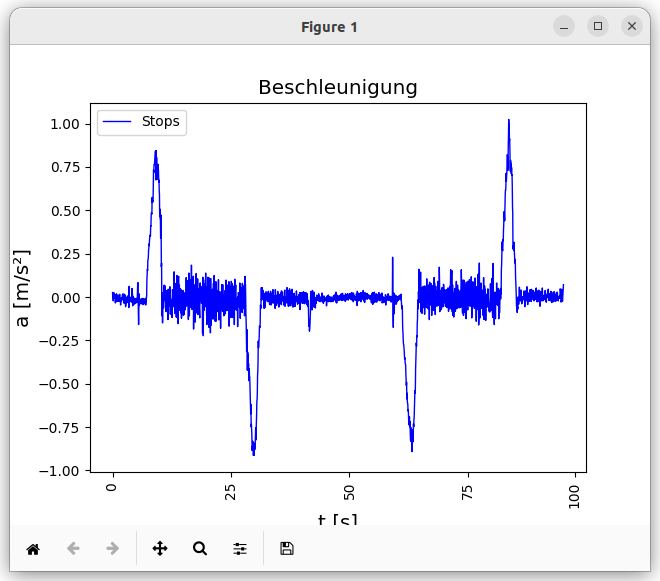
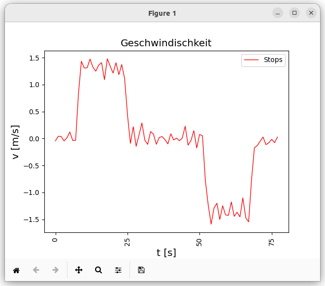

# Anleitung
Es ist ein kleines Tool, um die Relation zwischen der Beschleunigung bzw. Geschwindischkeit und der Zeit auf einem 
Diagramm darzustellen. 
Man kann den Skript test.py ausführen um einen Überblick dazu zu erhalten. 
Essind zwei Haupt Funktionen implementiert ''draw_velocity(time_list,velocity_list)'' und ''draw_acceleration(time_list,acceleration_list)'' und dafür wurde CSV Lib benutzt um daten aus einem csv Datei auszulesen und als Liste zur Verfügung zu bekommen.
## Benutzte Bibliotheken für die Ausführung:
**csv**,**pandas**,**matplotlib**,**numpy**
## Fotos
Unten sind es 2 Bilder zum Projekt: 
 

